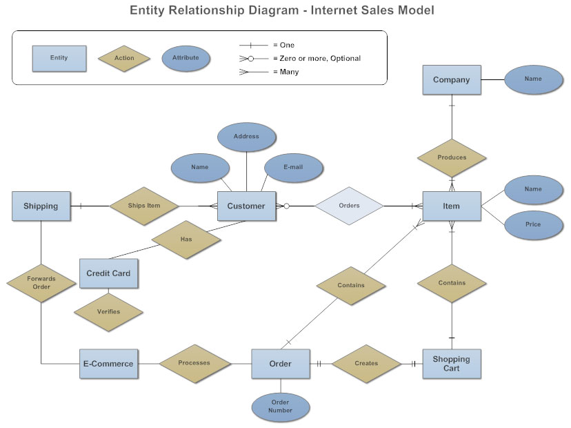

# Entity Relationship Diagrams


An **entity relationship diagram \(ERD\)** shows the relationships of entity sets stored in a database.


An entity in this context is an object, a component of data. An entity set is a collection of similar entities. These entities can have attributes that define its properties. By defining the entities, their attributes, and showing the relationships between them, an ER diagram illustrates the logical structure of databases.

ER diagrams are used to sketch out the design of a database.

* **Entities**, which are represented by rectangles.
* **Weak entity** is an entity that must defined by a foreign key relationship with another entity as it cannot be uniquely identified by its own attributes alone \(rectangle with double border\).
* **Actions**, which are represented by diamond shapes, show how two entities share information in the database.
* **Attributes**, which are represented by ovals. A key attribute is the unique, distinguishing characteristic of the entity.
* **Connecting lines**, solid lines that connect attributes to show the relationships of entities in the diagram.
* **Cardinality** specifies how many instances of an entity relate to one instance of another entity.
* **Ordinality** describes the relationship as either mandatory or optional. In other words, cardinality specifies the maximum number of relationships and ordinality specifies the absolute minimum number of relationships.

